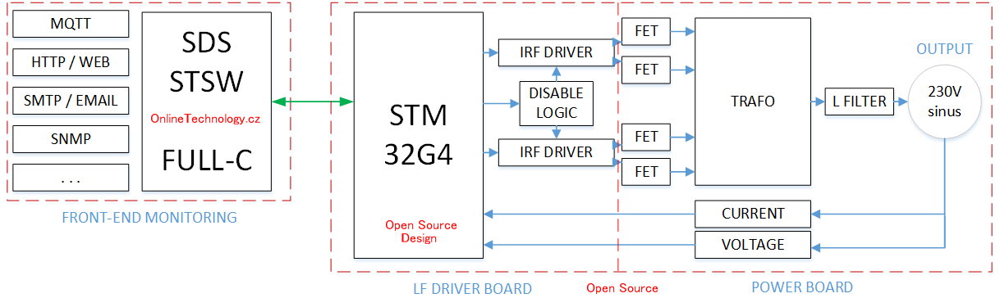
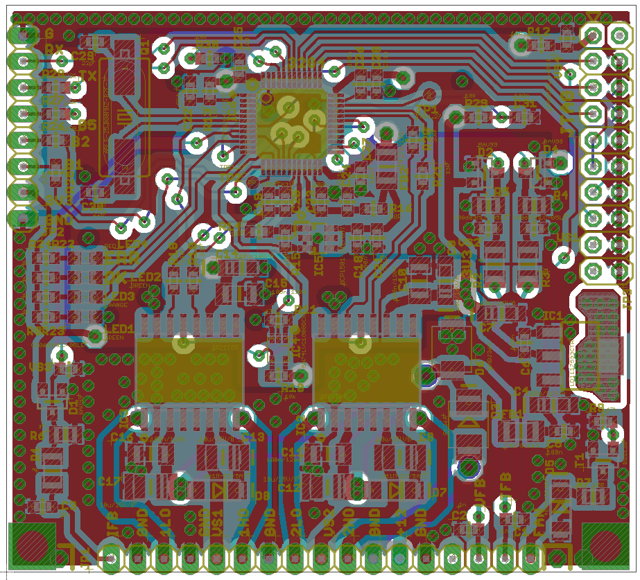
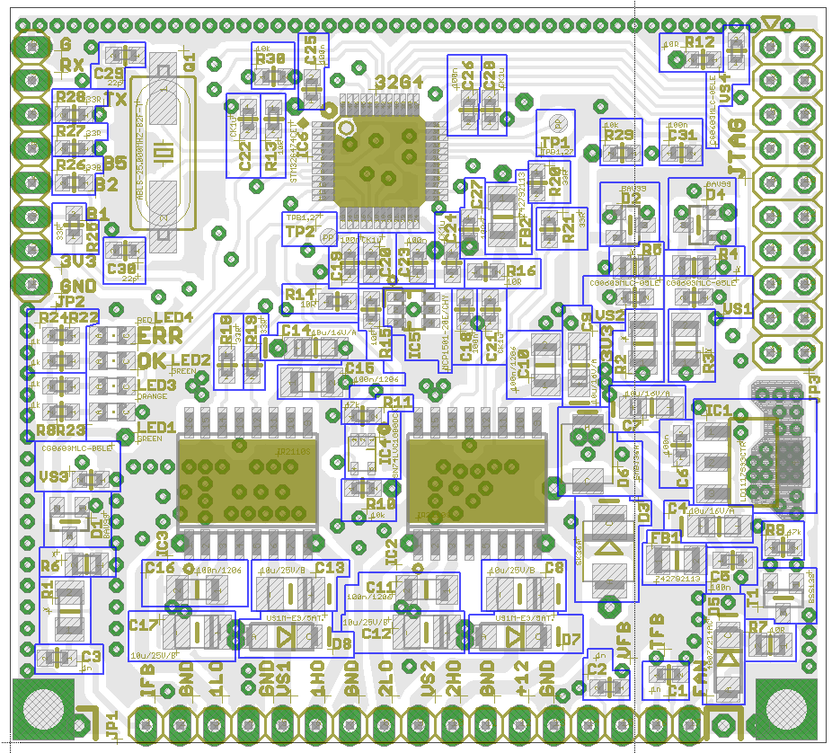

# WIKI

https://github.com/myp-cz/ST-SPWM-AN1/wiki

# License

Creative Commons BY-NC-ND

# Idea

Standalone control and driver board, a contrallable generator of four interconnected SPWM outputs, directly suitable for FET/etc. H-bridge driving.

The goal is to provide an totaly clear open-source solution of such a driver, including HW and FW contents.

# Global Integration

LF Driver Board is a part of a complete system. You can build any complete system as you want.

We are providing the following complete example: Main LF Power Board + LF Driver Board + "SDS-STSW"

# Overall Integration

The following diagram shows the overall *simplified* idea:

# Driver Board Schematics

rev1 release on 28-Oct-2020

# Driver Board PCB

rev1 release on Jan-2021

Eagle 5.60 screen shot: 

Component population overview (screen shot):

