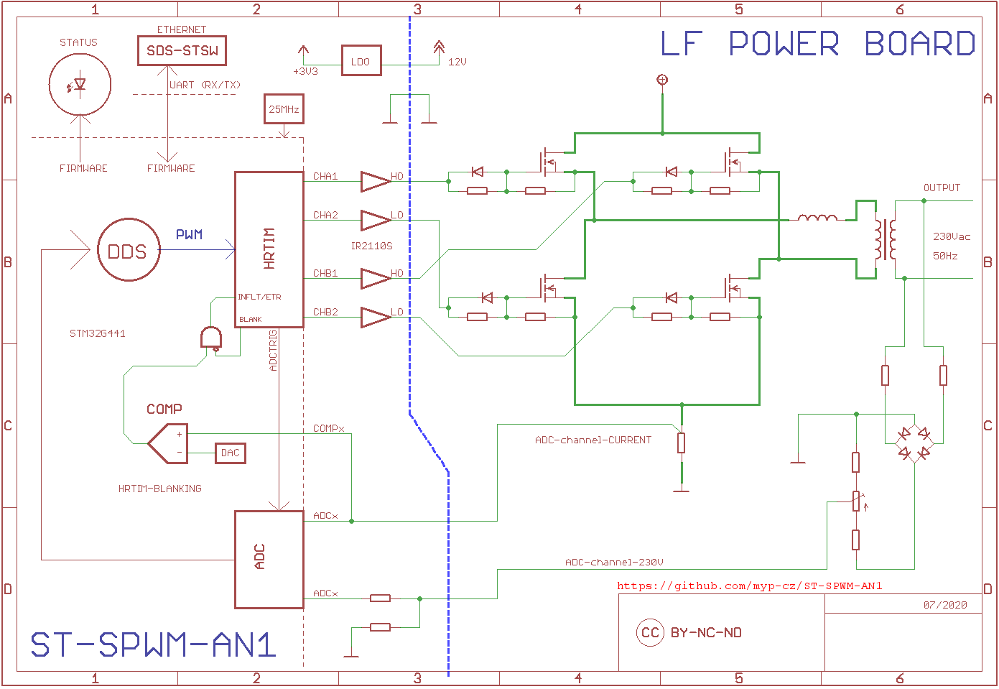

# WIKI

https://github.com/myp-cz/ST-SPWM-AN1/wiki

# License

Creative Commons BY-NC-ND

# Idea

Standalone control and driver board, a contrallable generator of four interconnected SPWM outputs, directly suitable for FET/etc. H-bridge driving.

The goal is to provide an totaly clear open-source solution of such a driver, including HW and FW contents.

# Overall Integration

The following diagram shows the overall *simplified* idea:

# Driver Board Schematics

rev1 release on 28.10.2020

